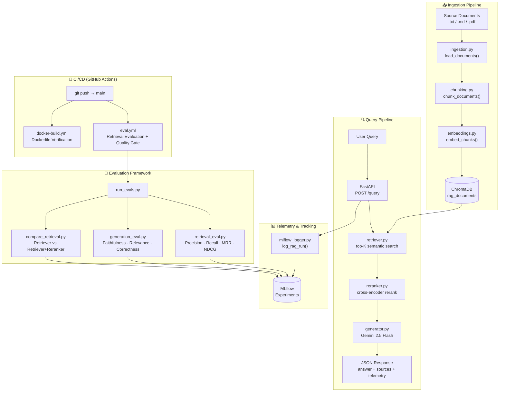
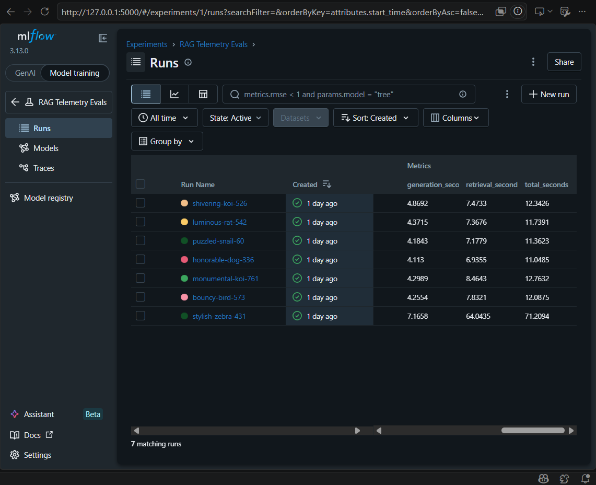
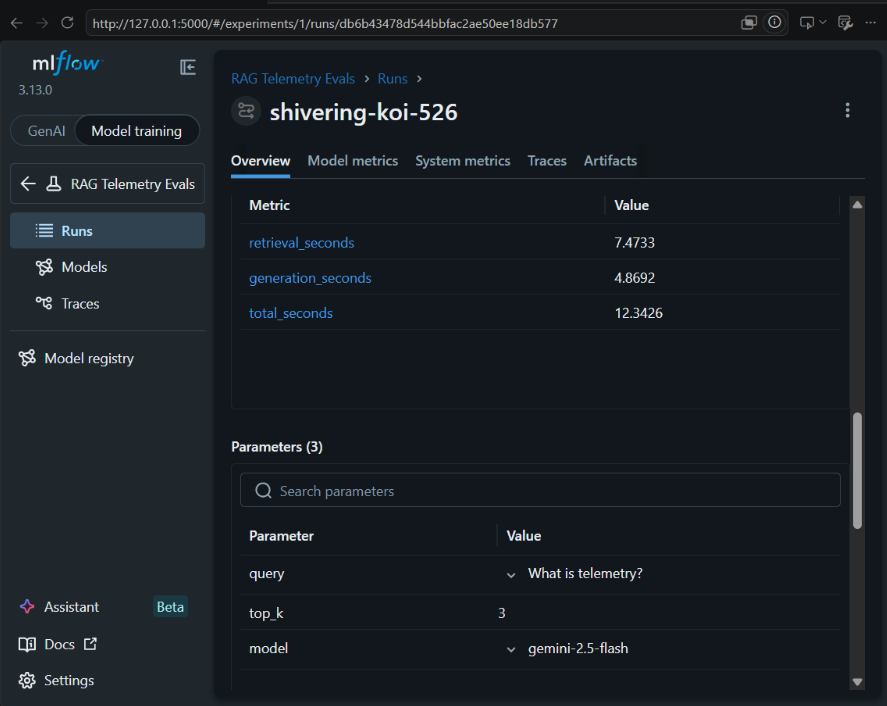

# RAG Telemetry & Evals

[](https://github.com/Dhivindharshan/rag-telemetry-evals/actions/workflows/eval.yml)
[](https://github.com/Dhivindharshan/rag-telemetry-evals/actions/workflows/docker-build.yml)
[](https://www.python.org/downloads/)
[](LICENSE)

A production-style **Retrieval-Augmented Generation (RAG)** pipeline with end-to-end telemetry, automated retrieval evaluation, LLM-as-a-judge generation evaluation, MLflow experiment tracking, and a Dockerized FastAPI deployment.

Built to demonstrate MLOps engineering practices: automated evaluation gates in CI/CD, experiment tracking, containerization, and observability.

---

## Architecture



---

## Features

| Feature | Implementation |
|:--------|:--------------|
| Document ingestion | PDF, TXT, Markdown — auto-chunked at 500 tokens with 50-token overlap |
| Semantic retrieval | `all-MiniLM-L6-v2` bi-encoder via sentence-transformers + ChromaDB |
| Cross-encoder reranking | `ms-marco-MiniLM-L-6-v2` — pool × 2 candidates, rerank to top-K |
| Answer generation | Google Gemini 2.5 Flash via `google-genai` SDK |
| Experiment tracking | MLflow — per-request runs under "RAG Telemetry Evals" experiment |
| Retrieval evaluation | Precision@K, Recall@K, MRR, NDCG@K, Hit Rate on 13-query golden dataset |
| Generation evaluation | LLM-as-a-judge (Gemini) for faithfulness, relevance, correctness |
| Pipeline comparison | Automated Retriever-Only vs. Retriever+Reranker A/B evaluation |
| CI quality gate | GitHub Actions fails the build if any metric drops below threshold |
| Containerization | CPU-only Docker image (~1.2 GB), non-root user, healthcheck |

---

## Tech Stack

| Layer | Technology |
|:------|:-----------|
| API server | FastAPI + Uvicorn |
| Vector store | ChromaDB (persistent, local) |
| Embeddings | sentence-transformers `all-MiniLM-L6-v2` |
| Reranker | `cross-encoder/ms-marco-MiniLM-L-6-v2` |
| LLM | Google Gemini 2.5 Flash (`gemini-2.5-flash`) |
| Experiment tracking | MLflow |
| Containerization | Docker (CPU-only PyTorch, non-root, healthcheck) |
| CI/CD | GitHub Actions (pip cache, Docker BuildKit cache, artifact upload) |
| Config | Pydantic v2, python-dotenv |
| Language | Python 3.11 |

---

## Evaluation Results

Evaluated on a 13-query golden dataset covering MLOps, RAG, embeddings, and retrieval topics.

### Retrieval Metrics (top\_k = 3)

| Metric | Score | Interpretation |
|:-------|------:|:---------------|
| Precision@3 | **0.7436** | 74% of retrieved chunks are relevant |
| Recall@3 | **0.6731** | 67% of all relevant chunks are retrieved |
| MRR | **0.8462** | First relevant result appears at rank 1.2 on average |
| NDCG@3 | **0.82** | Ranking quality — relevant chunks appear near the top |
| Hit Rate | **0.9231** | At least one relevant chunk found in 92% of queries |

### Generation Metrics

Evaluated using Gemini 2.5 Flash as an LLM-as-a-judge, scoring 0–1 per sample:

| Metric | Description |
|:-------|:------------|
| Faithfulness | Answer is grounded in retrieved context — no hallucinations |
| Answer Relevance | Answer directly addresses the user's question |
| Answer Correctness | Answer matches the reference ground truth |

---

## Project Structure

```
rag-telemetry-evals/
├── api/
│   └── main.py              
├── src/
│   ├── ingestion.py         
│   ├── chunking.py          
│   ├── embeddings.py        
│   ├── retriever.py         
│   ├── reranker.py          
│   ├── generator.py         
│   ├── pipeline.py          
│   └── vector_store.py      
├── telemetry/
│   ├── mlflow_logger.py     
│   ├── tracer.py            
│   └── tracing.py          
├── evals/
│   ├── run_evals.py        
│   ├── retrieval_eval.py    
│   ├── generation_eval.py   
│   ├── compare_retrieval.py 
│   └── golden_dataset.json  
├── data/                    
├── .github/
│   └── workflows/
│       ├── eval.yml         
│       └── docker-build.yml 
├── Dockerfile               
├── requirements.txt
└── config.yaml
```

---

## Quick Start

### Local development

```bash

git clone https://github.com/Dhivindharshan/rag-telemetry-evals.git
cd rag-telemetry-evals
python -m venv .venv && source .venv/bin/activate  


pip install torch --index-url https://download.pytorch.org/whl/cpu
pip install -r requirements.txt


cp .env.example .env
cd src && python vector_store.py && cd ..

uvicorn api.main:app --reload --port 8001
curl -X POST http://localhost:8001/query \
  -H "Content-Type: application/json" \
  -d '{"query": "What is MLOps?", "top_k": 3}'
```

### Docker

```bash
docker build -t rag-telemetry-evals .
docker run -p 8000:8000 \
  -e GEMINI_API_KEY=your_key_here \
  -v rag-chroma:/app/data/chroma_db \
  rag-telemetry-evals
curl http://localhost:8000/health
```

---

## Running Evaluations

```bash

python evals/run_evals.py --mode retrieval --top-k 3


python evals/run_evals.py --mode generation --top-k 3


python evals/run_evals.py --mode retrieval-compare --top-k 3 --pool-factor 2


python evals/run_evals.py --mode all --top-k 3
```

Results are saved to `data/eval_results/` and logged to MLflow automatically.

---

## MLflow

```bash
# Launch the MLflow UI to explore experiment runs
mlflow ui

# Open http://localhost:5000
# Experiments: "RAG Telemetry Evals", "RAG Evaluation", "Retrieval Evaluation"
```

---

## CI/CD

Two GitHub Actions workflows run in parallel on every push to `main`:

| Workflow | What it does |
|:---------|:-------------|
| `eval.yml` | Ingests documents → runs retrieval eval → enforces metric quality gate → uploads results as artifact |
| `docker-build.yml` | Builds the Docker image using BuildKit → fails if Dockerfile is broken |

Quality gate thresholds (configurable in `eval.yml`):

| Metric | Minimum |
|:-------|--------:|
| Precision@K | 0.50 |
| Recall@K | 0.40 |
| MRR | 0.60 |
| NDCG@K | 0.50 |
| Hit Rate | 0.70 |

Evaluation results JSON and the MLflow tracking database are uploaded as downloadable artifacts on every run. Download the artifact and run `mlflow ui` locally to explore the experiment.

---

## Environment Variables

| Variable | Required | Description |
|:---------|:--------:|:------------|
| `GEMINI_API_KEY` | For generation | Google Gemini API key |

Copy `.env.example` to `.env` and fill in your values. The `.env` file is excluded from git and Docker image builds.

## MLflow Experiment Tracking

### Experiment Overview



### Run Details


